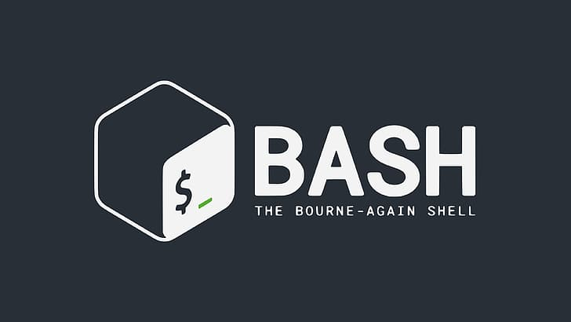
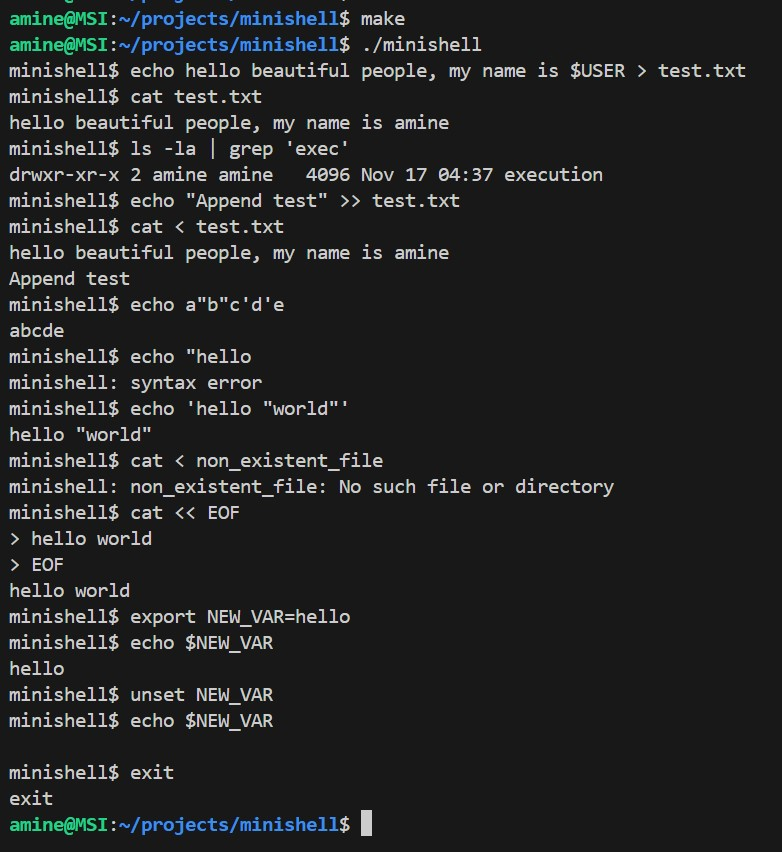

#  Minishell - A Lightweight Bash Implementation


**Minishell** is a custom shell implementation written in C as part of the 42 Network curriculum. It parses prompts, manages processes, and executes commands, replicating core Bash functionalities while adhering to strict memory management rules.

<table>
  <tr>
    <td width="50%" valign="top">
      
      <br />
      
    </td>
        <td width="50%" valign="top">
      
    </td>
  </tr>
</table>


##  Features

### Core Capabilities
- **Command Execution:** Supports absolute, relative, and `$PATH` based execution.
- **Pipelines:** Implements `|` to connect command outputs and inputs via file descriptors.
- **Redirections:** Handles input (`<`, `<<`) and output (`>`, `>>`) streams.
- **Environment Variables:** Expands `$VAR` and handles exit status `$?`.

### Built-in Commands
- `echo` (with `-n` option)
- `cd` (with relative/absolute paths)
- `pwd`
- `export`
- `unset`
- `env`
- `exit`

### Signal Handling
- **Ctrl-C:** Interrupts current process (SIGINT).
- **Ctrl-D:** Exits the shell (EOF).
- **Ctrl-\:** Ignores quit signal (SIGQUIT).

---

##  Technical Architecture

This project was built from scratch without using high-level libraries (like `system()` or standard RegEx).

1.  **Lexer & Tokenizer:** Breaks raw input strings into tokens (words, operators, quotes).
2.  **Parser:** Validates syntax and builds a command table.
3.  **Expander:** Processes environment variables and quote removal.
4.  **Executor:**
    - Uses `fork()` to create child processes.
    - Uses `execve()` to execute binaries.
    - Manages file descriptors (`dup2`, `pipe`) for redirection.
    - Handles parent-child process synchronization via `waitpid()`.

---

##  Memory Management

This project follows the **42 Norm**, enforcing strict coding standards.
- **Zero Leaks:** All allocated memory is freed, even in error states.
- **Error Handling:** Robust protection against segmentation faults and double-frees.
- Verified using **Valgrind**.

---

##  How to Run

1. **Clone the repository:**
   ```bash
    git clone https://github.com/amine-za/Minishell-1337.git
    cd Minishell-1337
   ```

2. **Compile:**

    ```Bash
    make
    ```

3. **Run:**

    ```Bash
    ./minishell
    ```
---

## Example Usage

```bash
    minishell$ echo "Hello World" | cat -e > outfile
    minishell$ cat < outfile
    Hello World$
``` 